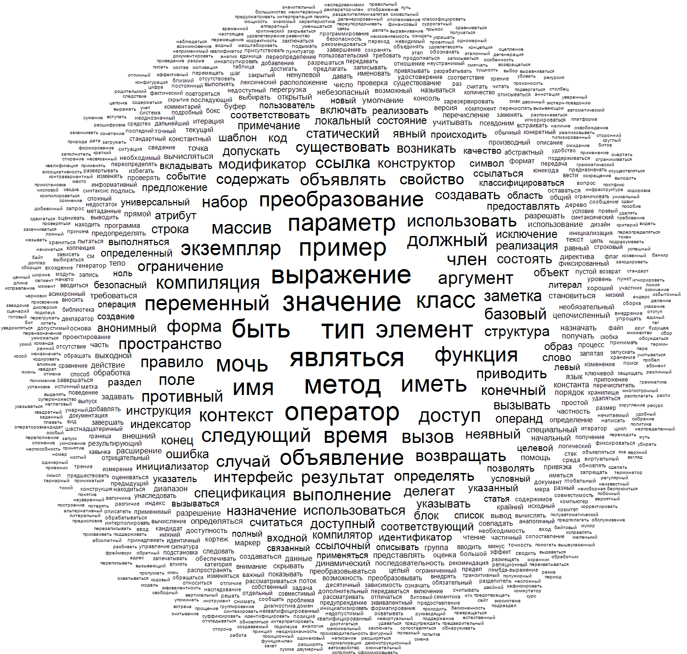
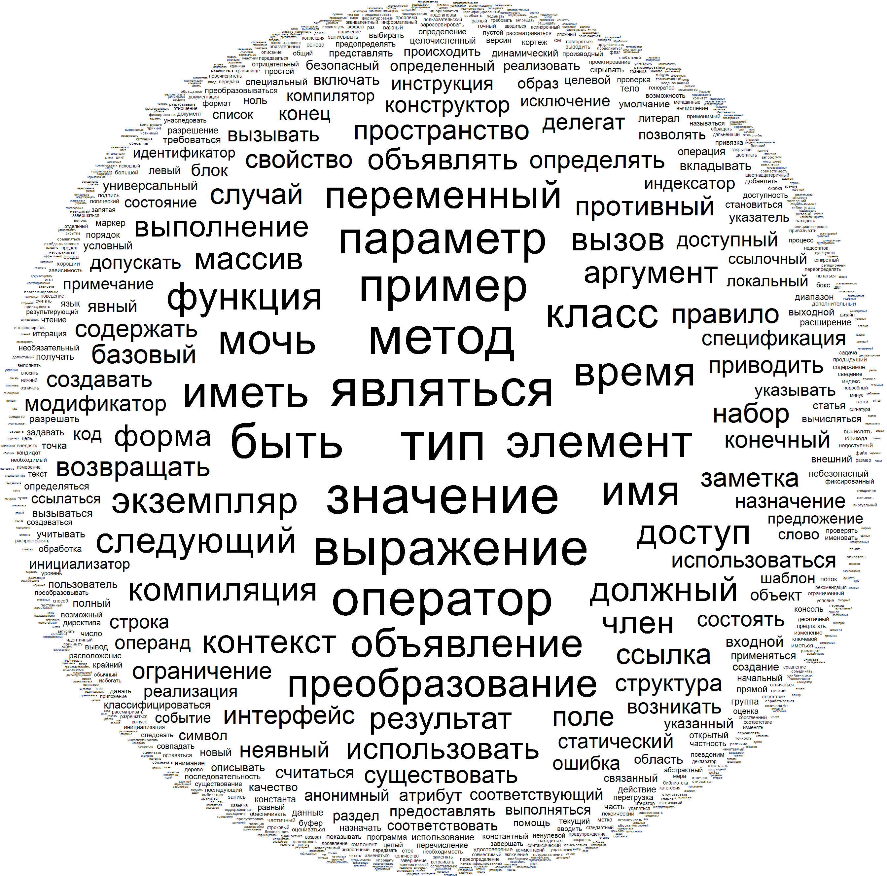
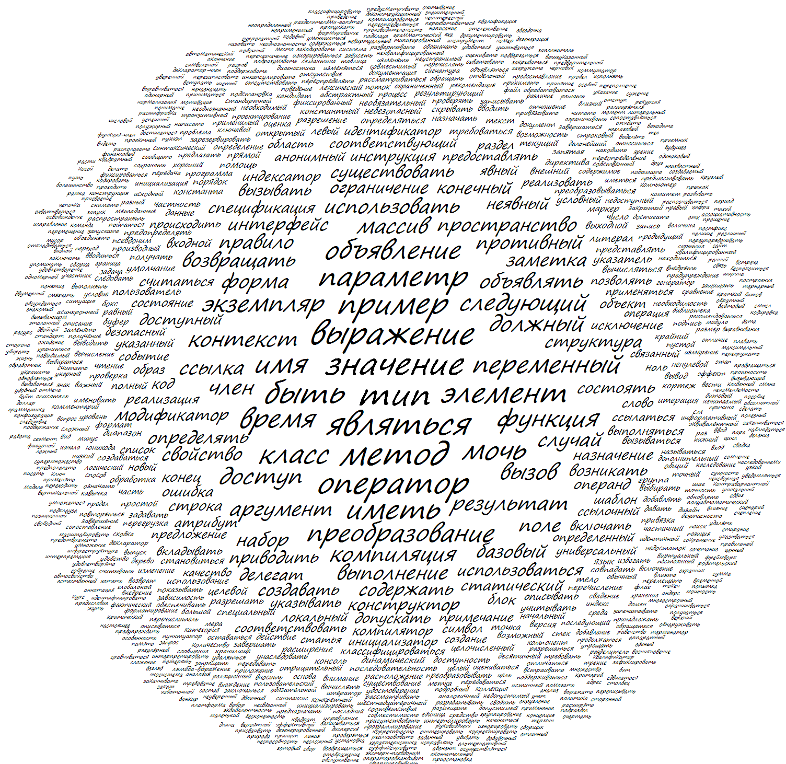
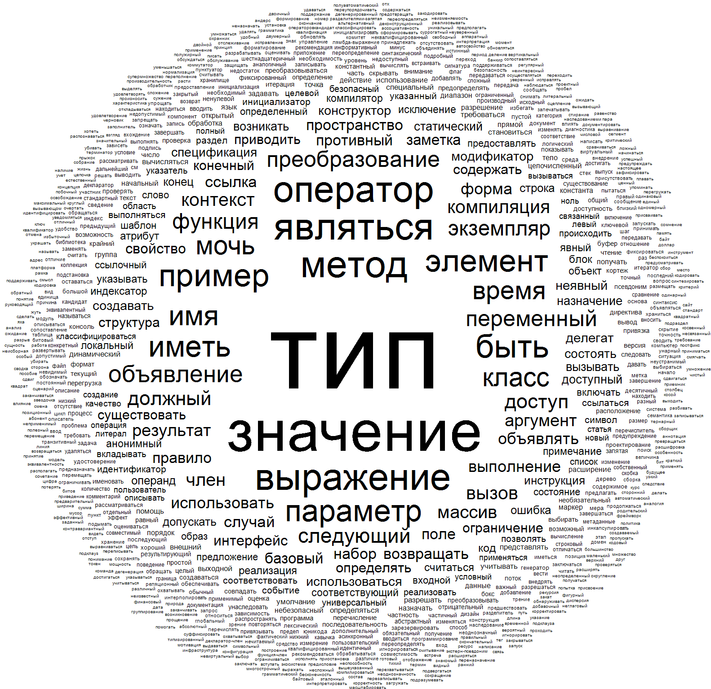
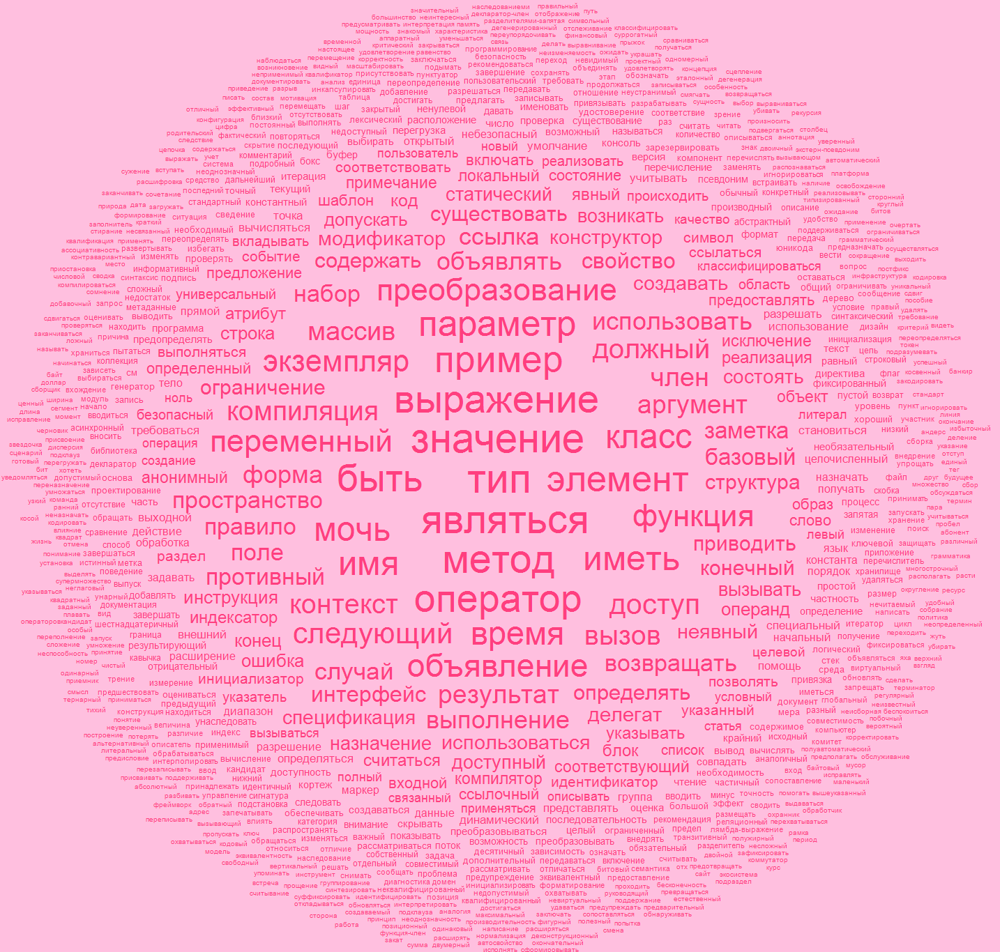
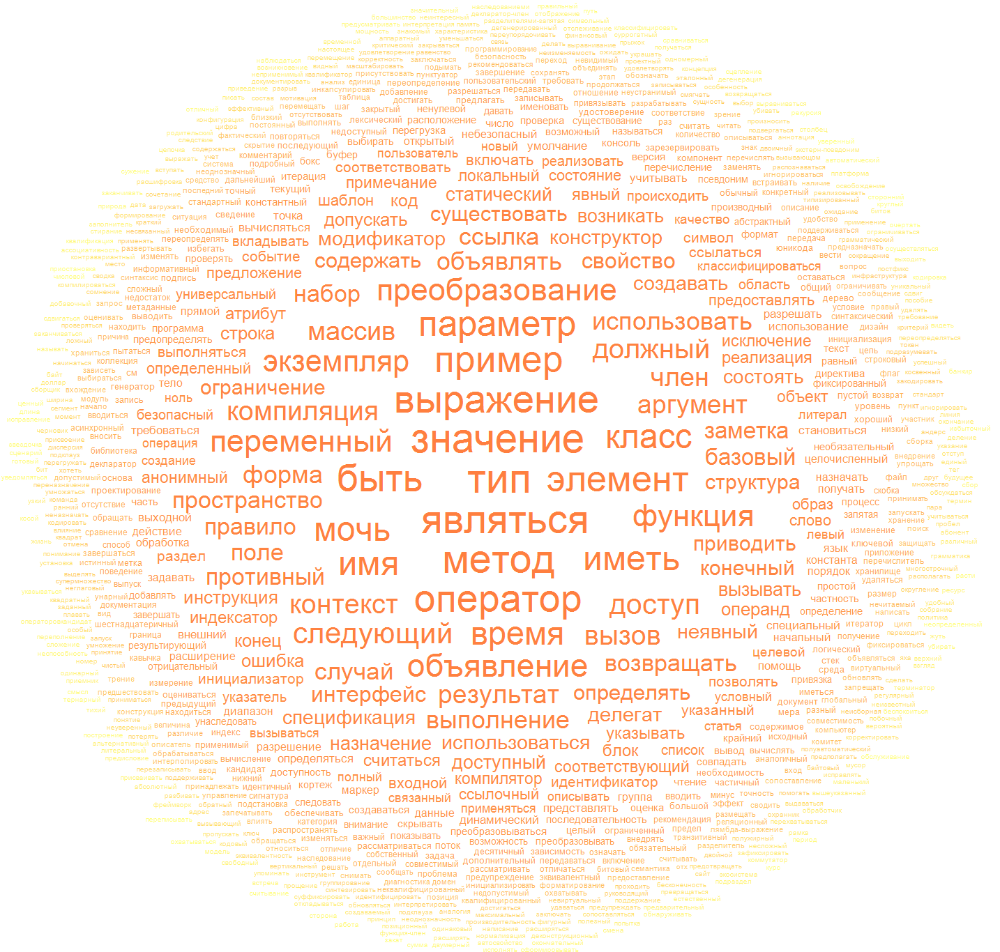
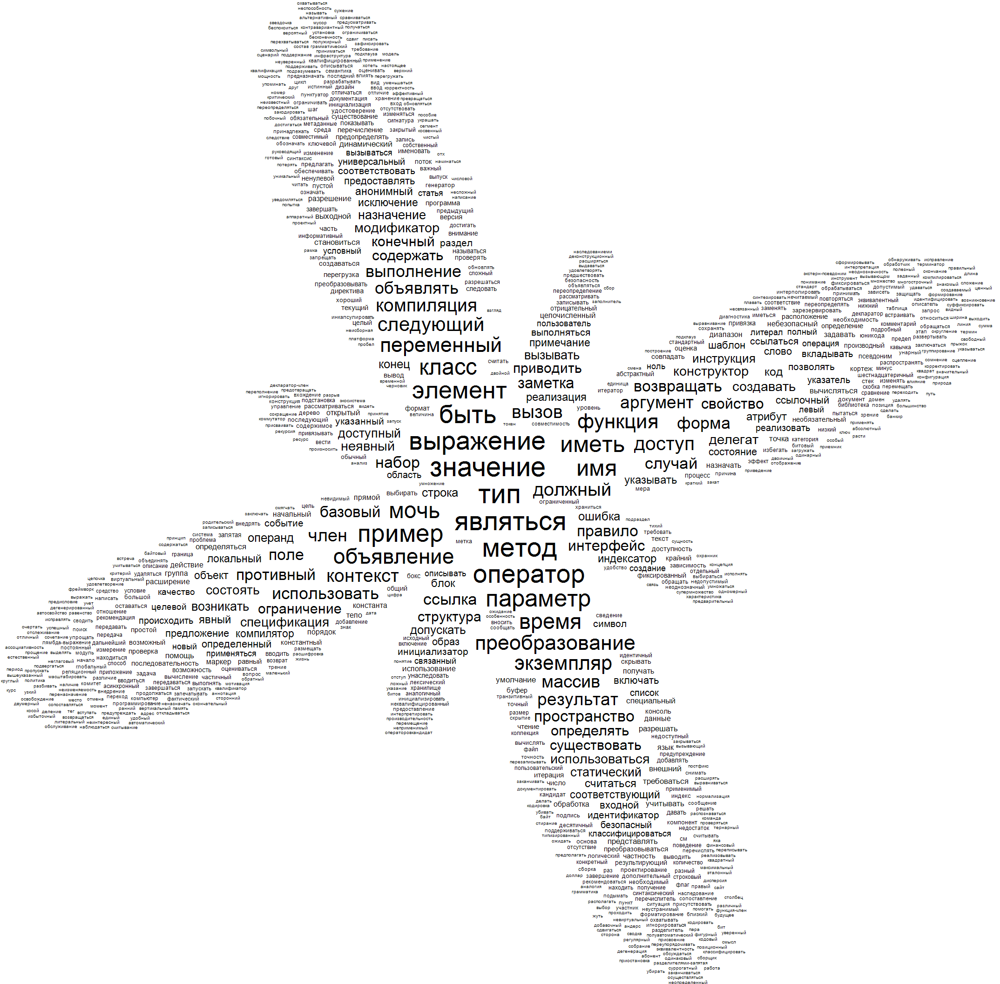
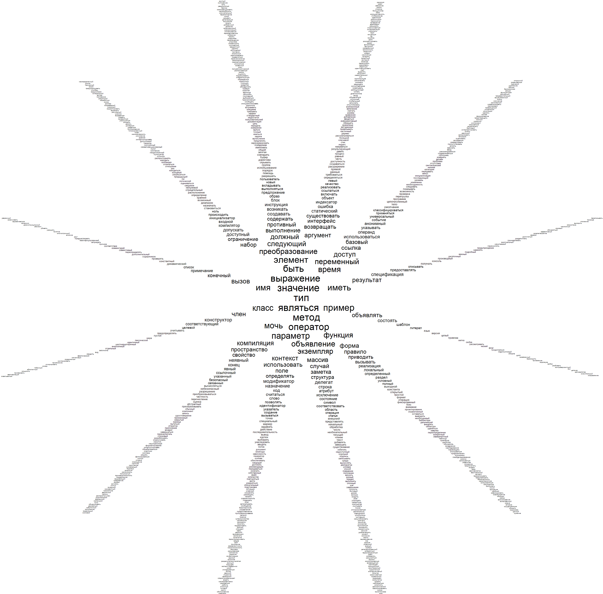
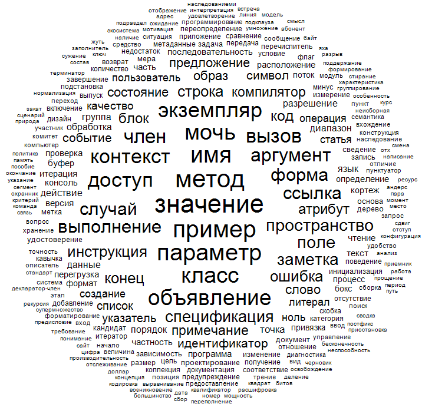

# Примеры команд

## --in in.txt --out out.png

--in задает путь до файла с текстом.

--out задает путь, куда нужно будет сохранить полученное изображение.

## --in in.txt --out out.png --min-word-size 8 --word-size-scale 3.2

--min-word-size задает минимальный размер слова в пикселях.

--word-size-scale задает множитель разницы между размерами тегов.

## --in in.txt --out out.png --font "Segoe Print" --font-style Italic

--font задает шрифт слов.

--font-style задает стиль шрифта.

## --in in.txt --out out.png --sizing frequency

--sizing задает метод, по которому вычисляется размер тегов.

- Frequency - размер слова увеличивается на scale за каждое появление слова в тексте.
- SmoothFrequency - слова разделяются на группы по количеству появлений в тексте. Размер слов в каждых двух соседних (наиболее близких друг к другу) группах различается на scale.

По умолчанию используется SmoothFrequency.

## --in in.txt --out out.png --background #FFBFDF --main-color #FF3F7F

--background задает цвет фона.

--main-color задает цвет слов.

## --in in.txt --out out.png -drawing-settings gradient --main-color #FF7F3F --secondary-color #FFFF7F

--drawing-settings задает дополнительные методы обработки тегов

- Gradient - изменяет цвет слов в диапазоне от main-color до secondary-color по порядку.

## --in in.txt --out out.png --layouter shaped --radius "0.333 + Math.Cos(4 * angle + Math.PI / 2)"

--layouter задает метод расстановки тегов.

- Circle - расстановка по кругу.
- Shaped - использут формулу формата 'radius = f(angle)', заданную параметром radius, для расстановки тегов.

По умолчанию используется Circle.

## --in in.txt --out out.png --rays-count 12

Расстановка тегов идет вдоль лучей, исходящих из центра.

--rays-count задает количество этих лучей.

## --in in.txt --out out.png --exclude-words exclude.txt --pos S

--exclude-words задает путь до файла и исключает из используемых слов слова, находящиеся в этом файле.

--pos задает используемые части речи. По умолчанию используется A, S, V.

